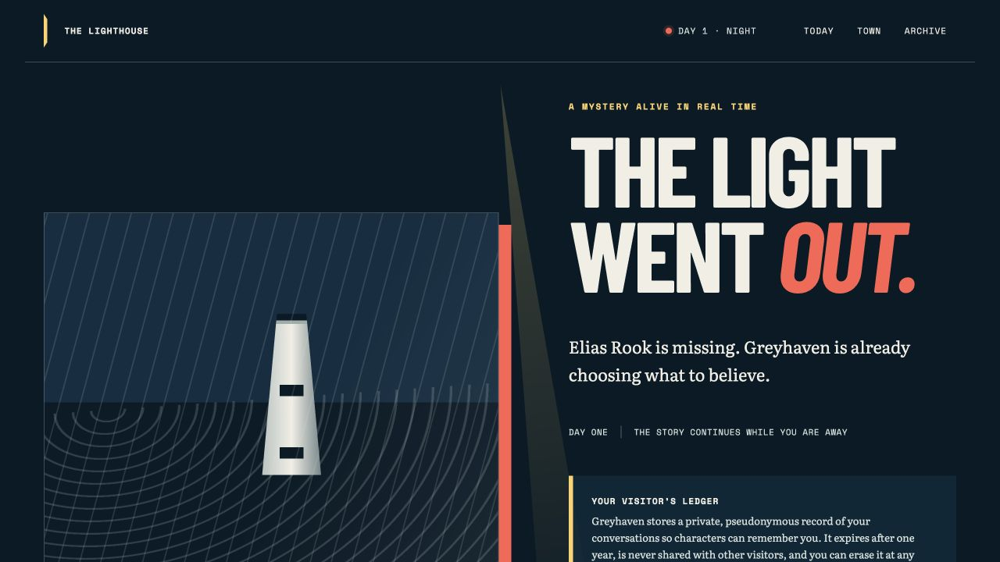

# Rumor Mill AI

**A living AI web-toon where characters keep secrets, spread rumors, and continue their lives
while you are away.** Visitors enter the same persistent mystery, but each character answers from
their own beliefs, memories, relationships, and incomplete version of events.

[Play The Lighthouse](https://rumormill-5e6f53c74e73.herokuapp.com/lighthouse) ·
[Read the architecture](docs/architecture/README.md) ·
[Author a world](docs/world-authoring-format.md) ·
[Contribute](CONTRIBUTING.md)



> **Project status:** public MVP. The Lighthouse vertical slice, durable simulation, fake and
> OpenAI providers, narrative evaluations, privacy controls, CI/CD, and Heroku deployment are in
> place. The API and authoring format may still change before a stable release.

## What makes it different

- **Subjective characters:** canon is separate from what each character believes, remembers, and
  chooses to reveal.
- **A town that keeps moving:** a durable scheduler advances wall-clock stories and safely catches
  up after worker downtime.
- **Returning-player continuity:** private, pseudonymous visitor state lets conversations and
  relationships carry forward.
- **Worlds as data:** validated, versioned JSON defines cast, locations, routines, relationships,
  and story constraints; the engine is not tied to The Lighthouse.
- **Reproducible by default:** deterministic fake-model responses, fixed seeds, isolated test
  databases, and narrative evals make the core runnable without an API key.

## Five-minute local quickstart

Prerequisites: Python 3.11+, [uv](https://docs.astral.sh/uv/), Docker with Compose, Git, and Make.
The default setup uses the deterministic fake provider and makes no model API calls.

```shell
git clone https://github.com/mflood/rumor-mill-ai.git
cd rumor-mill-ai
cp .env.example .env
make setup
make db-up
make db-migrate
make run
```

Open <http://127.0.0.1:8787/lighthouse>. The API docs are at
<http://127.0.0.1:8787/docs>, and `curl http://127.0.0.1:8787/health` should return
`{"status":"ok","environment":"development"}`.

To stop the database later, run `make db-down`. Local Postgres is published on port `55432` and
the app on `8787`. Override `RUMOR_MILL_POSTGRES_PORT` or `RUMOR_MILL_API_PORT` in `.env`; if the
Postgres port changes, update the port in `RUMOR_MILL_DATABASE_URL` too.

### Use a real model provider

Fake mode exercises the complete application flow with repeatable responses. To use OpenAI,
change only these values in your untracked `.env` file, then restart the web process:

```dotenv
RUMOR_MILL_MODEL_PROVIDER=openai
RUMOR_MILL_OPENAI_API_KEY=your-api-key
# Optional; defaults to the model configured by the project
# RUMOR_MILL_OPENAI_MODEL=your-model
```

Real-provider calls cost money and can vary between runs. Never commit `.env` or expose its keys in
logs. Provider timeouts, retries, token budgets, and error normalization live behind the same model
port used by fake mode.

### Run the worker and seed the demo world

The web process is enough to browse the static story shell. In another terminal, start the worker
to advance wall-clock simulations:

```shell
uv run python -m rumor_mill.worker
```

Validate The Lighthouse world, seed a deterministic run, and generate a fourteen-day zero-cost
smoke transcript with:

```shell
make seed-lighthouse
```

## Architecture

```text
Browser / API clients
        │
        ▼
FastAPI + server-rendered story UI ──────► model-provider port ──► fake | OpenAI
        │
        ▼
application services + simulation engine
        │                         ▲
        ▼                         │
repository ports ──► PostgreSQL ◄─┴─ durable worker / scheduler
```

The simulation engine owns canon, subjective beliefs, memories, conversations, propagation,
scene generation, recaps, and scheduling. FastAPI, SQLAlchemy/Postgres, provider clients, and the
worker are adapters around those engine contracts. See the [architecture overview](docs/architecture/README.md)
for system boundaries and data flow, and [ADRs](docs/adr/README.md) for the decisions behind them.

## Core engine vs. included demo

**Rumor Mill core** is the reusable Python package under `src/rumor_mill/`: domain rules, engine
services, ports, persistence/provider adapters, APIs, worker, evaluations, and world validation.
It should remain independent of any one story.

**The Lighthouse** is the included demonstration world. Its authored JSON and story documents are
under `docs/worlds/lighthouse/`; its visitor-facing HTML/CSS/JavaScript is under
`src/rumor_mill/web/`. It proves the engine with Greyhaven's missing lighthouse keeper, but is not
the engine itself.

## Repository map

```text
src/rumor_mill/
  engine/              domain services and infrastructure ports
  adapters/            Postgres repositories and model providers
  worlds/              world validation, seeding, and continuity
  evals/               deterministic narrative evaluation runner
  web/                 The Lighthouse demo presentation
  main.py              FastAPI web and service API
  worker.py            durable simulation worker
docs/
  architecture/        system overview
  adr/                 architecture decision records
  worlds/lighthouse/   demo world data and narrative specifications
migrations/            Alembic schema history
tests/                 unit, integration, Postgres contract, and end-to-end tests
```

## Test and development commands

```shell
make test             # complete deterministic suite with coverage
make test-unit        # fast domain and adapter isolation tests
make test-integration # SQLite-backed API, scheduler, and migration tests
make test-e2e         # returning-player lifecycle
make test-parallel    # prove process isolation
make lint             # Ruff and strict mypy
make ci               # all non-mutating CI checks, including narrative evals
make format           # apply formatting
```

The default suite requires no network or API key. Set `RUMOR_MILL_TEST_DATABASE_URL` to enable the
optional Postgres contract test. See [the test strategy](docs/testing.md) for the coverage map and
failure scenarios.

## More documentation

- [The Lighthouse story bible](docs/worlds/lighthouse/story-bible.md)
- [World-authoring format](docs/world-authoring-format.md)
- [Narrative evaluations](docs/narrative-evaluations.md)
- [Privacy and retention](docs/security/privacy-and-retention.md)
- [Heroku deployment and operations](docs/heroku-deployment.md)

## Community and license

Contributions are welcome. Read [CONTRIBUTING.md](CONTRIBUTING.md), including the provenance and
human-authorship expectations for world and AI-assisted content, before opening a pull request.
Community participation is governed by the [Code of Conduct](CODE_OF_CONDUCT.md); support and
private security-reporting routes are documented in [SUPPORT.md](SUPPORT.md) and
[SECURITY.md](SECURITY.md). Rumor Mill AI is available under the [MIT License](LICENSE).
