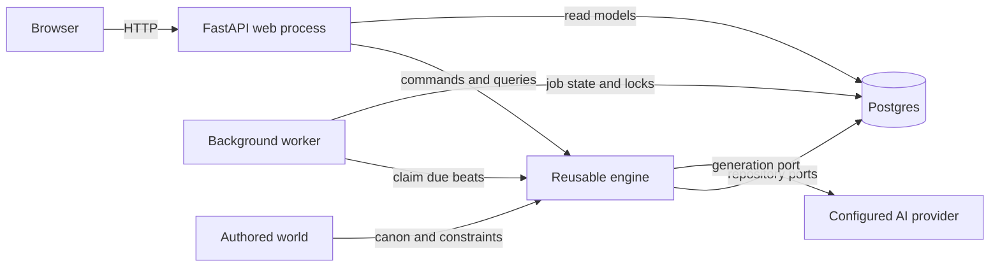
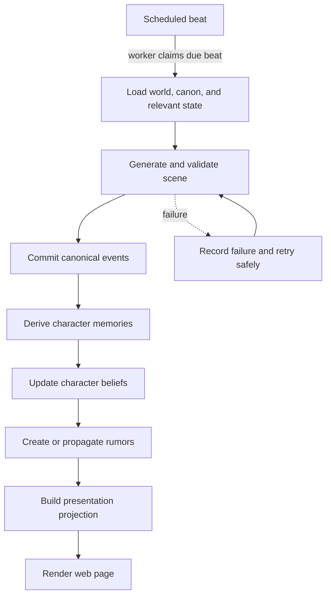

# MVP architecture

## Purpose

Rumor Mill turns an authored world into a continuously evolving story. The MVP is a modular
monolith: one deployable Python application and one Postgres database, with a separately running
worker using the same application code. Module boundaries preserve the option to extract services
later without paying the operational cost now.

The decisions behind this shape are recorded in the [architecture decision log](../adr/README.md).

## System boundaries

| Boundary | Owns | Depends on | Must not own |
| --- | --- | --- | --- |
| Reusable engine | Beat scheduling, scene generation orchestration, memory and belief updates, rumor propagation, domain contracts | Authored-world ports and operational ports | A particular world's content, HTTP, provider SDKs, or deployment details |
| Authored worlds | Characters, locations, canon, initial beliefs, narrative constraints, prompt material | Stable engine authoring contracts | Scheduling, persistence, HTTP handlers, or provider credentials |
| Web app | FastAPI routes, server-rendered pages, lightweight interactions, input validation, presentation view models | Engine use cases | Domain rules, direct model-provider calls, or background-job implementation |
| Operational adapters | Postgres repositories, background runner, model/provider clients, clock and observability implementations | Ports defined by the engine/application layer | Narrative policy or presentation decisions |

Dependencies point inward: the web app and operational adapters call engine/application ports. The
engine never imports FastAPI, database drivers, task-runner libraries, or provider SDKs. An authored
world is data plus implementations of authoring contracts; it is not a fork of the engine.

```text
rumor_mill/
├── engine/          # reusable domain rules and use cases
├── worlds/          # authored world packages and content
├── web/             # HTTP routes, templates, static assets, view models
└── adapters/        # Postgres, jobs, AI providers, clock, telemetry
```

This is the intended package direction, not a claim that every package exists in the bootstrap.
New implementation work should grow toward this layout.

## Runtime shape



Postgres is both the system of record and the MVP job-coordination mechanism. Web requests do not
perform long-running generation. A worker claims due work, runs idempotent application commands,
and records outcomes. Provider calls remain behind a port so domain behavior can be tested without
network access and providers can be changed through configuration.

## Story data flow



The transaction boundary is the application command that accepts a completed, validated generation
result. It atomically records the scene, canonical events, memories, beliefs, rumors, presentation
projection, and beat outcome. External provider calls happen outside that transaction. Retries use
the beat/job identity as an idempotency key so a scene cannot be committed twice.

Canon, memory, and belief are deliberately distinct:

- **Canon** records what objectively happened in the authored world.
- **Memory** records what a character experienced or was told, including source and time.
- **Belief** records a character's current interpretation and confidence; it may contradict canon.
- **Rumor** is transferable information with provenance, mutations, and a propagation history.
- **Presentation** is a disposable read model derived from story state, never the source of truth.

## Operational expectations

- Commands that mutate story state are idempotent and safe to retry.
- Postgres constraints enforce identity and ordering invariants; application code enforces narrative
  rules.
- The worker uses bounded retries with persisted status. Poison jobs become inspectable failures.
- Provider inputs and outputs are recorded with secrets removed, alongside model/config metadata.
- Structured logs correlate HTTP requests, beats, jobs, scenes, and provider calls.
- Migrations are forward-only in deployed environments and remain compatible during a rolling
  web/worker update.

## Explicit non-goals for the MVP

- **Multi-tenancy:** no tenant isolation, per-tenant billing, custom domains, or tenant-aware schema.
  The deployment hosts a single product-controlled catalog of worlds.
- **World marketplace or user-generated worlds:** no uploads, sales, plugin sandbox, moderation
  pipeline, or compatibility guarantees for third-party content.
- **Autonomous general agents:** characters do not run open-ended loops, choose arbitrary tools, or
  act outside scheduled engine use cases. All state changes pass through explicit domain commands.
- **Microservices:** no service-per-boundary, event bus, distributed transactions, or independent
  scaling until measured load or team ownership justifies extraction.
- **Real-time multiplayer:** no collaborative editing, presence, or websocket-driven simulation.
- **Native clients and rich SPA:** the web experience is server rendered with small, progressive
  enhancements; a public client API is not an MVP commitment.
- **Provider-specific product behavior:** provider-only features may be adapted behind a port, but
  core story semantics cannot require a particular vendor.

## Change rule

Changes that reverse an accepted ADR, move responsibilities across the four boundaries, or expand
an explicit non-goal require a new ADR. Small implementation choices that preserve these constraints
do not.
